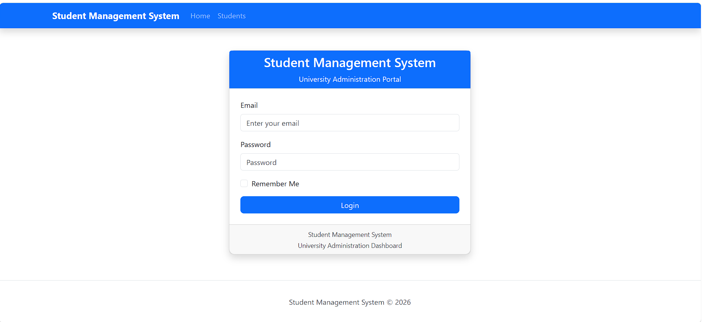
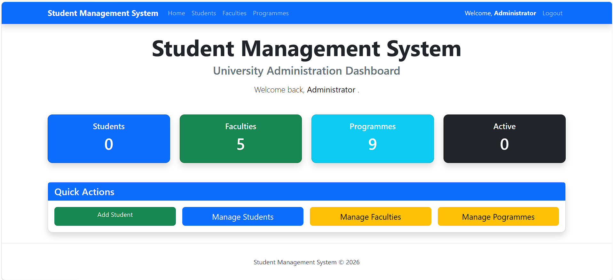
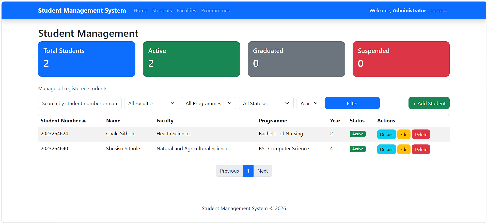
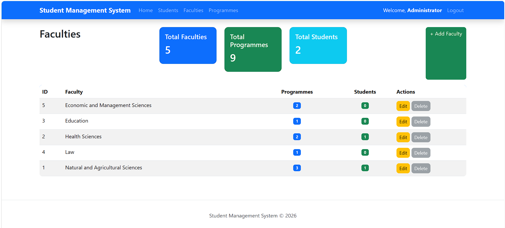
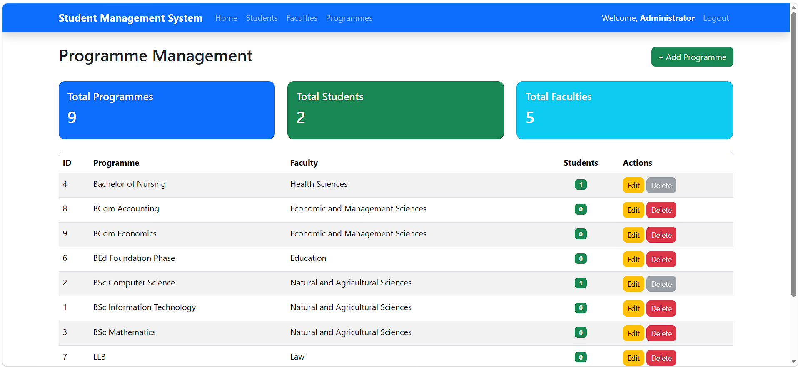

Student Management System

A modern Student Management System built with ASP.NET Core MVC, Entity Framework Core, SQL Server, and ASP.NET Identity.

This project demonstrates modern software engineering principles including layered architecture, dependency injection, authentication, role-based authorization, LINQ, Entity Framework Core, and responsive UI development using Bootstrap.
________________________________________
SCREENSHOTS

Login Page

 ________________________________________
Dashboard

________________________________________
Student Management

 ________________________________________
Faculty Management

 ________________________________________
Programme Management

 ________________________________________
FEATURES

Authentication & Security

•	ASP.NET Identity

•	Administrator Login

•	Lecturer Login

•	Secure Password Hashing

•	Role-Based Authorization

•	Protected Routes
________________________________________
Dashboard

•	University Administration Dashboard

•	Student Statistics

•	Faculty Statistics

•	Programme Statistics

•	Active Student Count

•	Quick Action Buttons
________________________________________
Student Management

•	Add Students

•	Edit Students

•	Delete Students

•	View Student Details

•	Search by Name or Student Number

•	Filter by Faculty

•	Filter by Programme

•	Filter by Status

•	Filter by Year Level

•	Sorting

•	Pagination

•	Duplicate Student Number Validation
________________________________________
Faculty Management

•	Create Faculties

•	Update Faculties

•	Delete Faculties

•	Faculty Statistics

•	Prevent deletion when programmes exist
________________________________________
Programme Management

•	Create Programmes

•	Update Programmes

•	Delete Programmes

•	Programme Statistics

•	Prevent deletion when students are enrolled
________________________________________
ARCHITECTURE

StudentManagementSystem

Controllers

{

 AccountControllerHomeController
 
 StudentController
 
 FacultyController
 
 ProgrammeController

}

Data

{
 
 ApplicationDbContext
 
 DbInitializer

}

Models

{

 Student
 
 Faculty
 
 Programme
 
 Enums
 
 ViewModels

}

Services

{
 
 StudentService
 
 FacultyService
 
 ProgrammeService

}

Views

wwwroot
________________________________________
TECHNOLOGIES

ASP.NET Core MVC for Web Framework

C#	for Programming Language

Entity Framework Core for ORM

SQL Server LocalDB for Database

ASP.NET Identity for Authentication & Authorization

Bootstrap 5	for Responsive UI

LINQ for Data Querying

Git for Version Control

GitHub for Repository Hosting
________________________________________
USER ROLES

Administrator

•	Full system access

•	Manage Students

•	Manage Faculties

•	Manage Programmes

•	Create, Edit and Delete records

Lecturer

•	Login securely

•	View Dashboard

•	View Student Records

•	Restricted from administrative actions
________________________________________
PROJECT STRUCTURE

Controllers/

Data/

Models/

Services/

Views/

wwwroot/
________________________________________
GETTING STARTED

Clone the repository

git clone https://github.com/ChaleSithole/student-management-system.git

Navigate to the project

cd student-management-system

Restore packages

dotnet restore

Apply migrations

dotnet ef database update

Run the application

dotnet run
________________________________________
DEFAULT ADMINISTRATOR ACCOUNT

Email

admin@university.co.za

Password

Admin@123

Note: These credentials are intended for local development only.
________________________________________
Current Progress

•	 Authentication

•	 Authorization

•	 Student CRUD

•	 Faculty CRUD

•	 Programme CRUD

•	 Dashboard

•	 Search

•	 Filtering

•	 Sorting

•	 Pagination

•	 Validation

•	 Responsive Design

•	 Service Layer

•	 Dependency Injection

•	 Entity Framework Core

•	 SQL Server Integration
________________________________________
FUTURE IMPROVEMENTS

•	Export to PDF

•	Export to Excel

•	Student Profile Photos

•	Email Notifications

•	Audit Logging

•	REST API

•	Docker Support

•	Azure Deployment
________________________________________
AUTHOR

Chale Sithole

BSc Information Technology
University of the Free State
________________________________________
